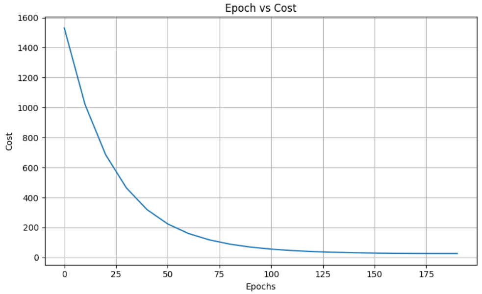
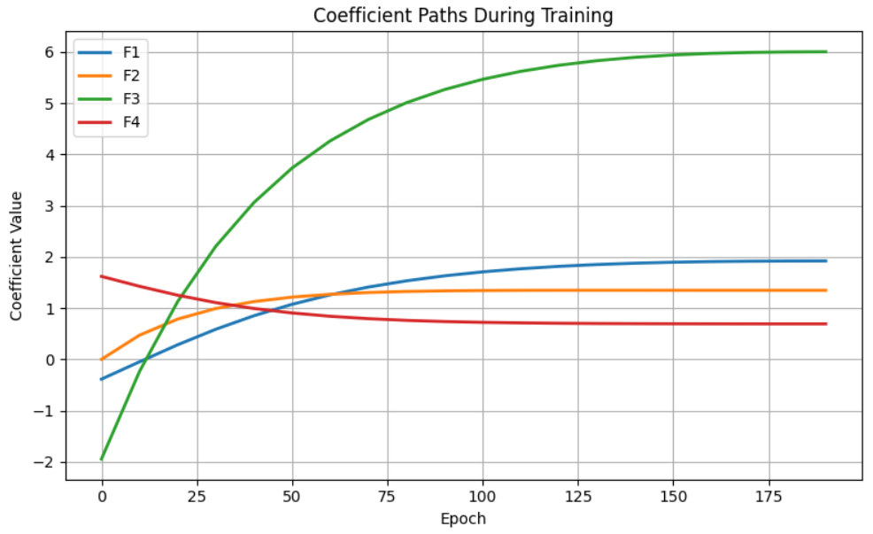
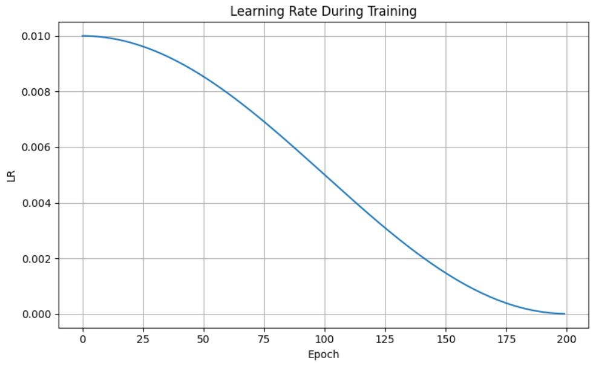

## **NeoForge**

### **Sleek, modular ML utilities for Linear & Logistic Regression**
### **A lightweight Python library designed with sklearn-style API for clean, professional workflows, enhanced logging, and visualization utilities**

### **Features:**

**Linear & Logistic Regression – Fit, predict, and evaluate with a consistent API**

**Modular utilities – Learning rate scheduler, weight tracking, plotting, and metrics**

**Modular & Extendable – Add new models or custom methods yourself without hassle**

**Demo Notebook – Quick showcase with example usage and visualizations**

### **Why NeoForge?**

**-Sklearn-style API – clean, consistent, professional**

**-Enhanced workflow – tracking, plotting, and extra utilities out of the box**

**-Extendable – easily add your own custom methods or models**

### **Usage**

1. **Model Initialization**
   ```bash
   model = Linear_Regression(l2 = 0, alpha = 0.01, iter = 200)

2. **Model Training**
   ```bash
   model.fit(x, y, verbose = 10, freeze = 0.1, save_history_interval = 10, random_state = 42, cosine_annealing = True, normalise = True)

### **Visualization Utilities**

1. **Cost vs Epoch**
   ```bash
   model.plot_cost()


2. **Coefficient Path**
   ```bash
   model.coefficient_path()


3. **Learning Rate Plot**
   ```bash
   model.lr_plot()


### **Attributes and Simple Methods**

1. **Predict**
   ```bash
   model.predict(x)

2. **Coefficients**
   ```bash
   model.coefficients_

3. **Intercept**
   ```bash
   model.intercept_

4. **Feature Importance**
   ```bash  
   model.feature_importance()

5. **Summary**
   ```bash
   model.summary()

### **License**
**MIT © Arjun Gupta**
